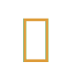

<!-- #region CROWN OF THE TOPAZ CHAPTER -->

<div align="center">
  <br>
  <picture>
    <source media="(prefers-color-scheme: dark)" srcset="assets/images/API-Wizard-Logo.svg">
    
  </picture>
  <br>
  <br>
</div>

<div align="center">
  <h1>
    <picture>
      <source media="(prefers-color-scheme: dark)" srcset="assets/images/API-Wizard-Title-Dark.svg">
      
    </picture>
  </h1>
</div>

<div align="center">
  <picture>
    <source media="(prefers-color-scheme: dark)" srcset="assets/images/API-Wizard-Subtitle-Dark.svg">
    
  </picture>
</div>

<!-- #endregion CROWN OF THE TOPAZ CHAPTER -->

<br>
<br>

<!-- #region CHRONICLES OF THE TOPAZ SANCTUM -->

*Sealed within the radiant **Topazurum Sanctum**, where crystals hum with the primal force of automation,
the **API Wizard** is a sacred key to The Wizardium’s grimoire.
Its runic seal, the elder **ᚢ Uruz**, yields only to masters of COM incantations,
unveiling foobar2000’s ActiveX realm to command its core with arcane JavaScript.

<br>

<h3 align="center"><em><span title="The Golden Key Shines">⸺ Aurea Clavis Splendet ⸺</span></em></h3>
<div align="center"><a href="https://github.com/The-Wizardium">A Sacred Chapter Of The Wizardium</a></div>

<br>
<h2></h2>
<br>
<br>

## Arcana Of The Topaz Spell

- **COM Automation Mastery**: Manipulate foobar2000’s ActiveX objects for playback, playlist, and library control.
- **Flexible Registration**: Supports registration-free COM (via MinHook) or traditional registry-based COM.
- **Scripting Power**: Seamless JavaScript integration for dynamic automation, with getter/setter properties
(e.g., window dimensions) and methods (e.g., window resizing, message display).
- **API Reference**: Comprehensive documentation for all COM methods and properties.

<br>

## Gather The Relics

- **Conjure** [foobar2000](https://www.foobar2000.org) - The foundational altar
- **Summon** [Spider Monkey Panel](https://github.com/TheQwertiest/foo_spider_monkey_panel) or
  [JSplitter](https://foobar2000.ru/forum/viewtopic.php?t=6378) - For JavaScript communion

<br>

## Perform The Ritual

01. **Invoke** foobar2000's installation ceremony.
02. **Channel** this sacred chapter from its [GitHub sanctum](https://github.com/The-Wizardium/API-Wizard).
03. **Bind** the component to your foobar2000 essence.

<br>

## Cast The Spell

- **Configure COM Registration**:
  - Set the COM registration method in `MyCOM.cpp`:
    ```cpp
    static HRESULT RegisterMyCOM(std::wstring_view regMethod = L"RegFree"); // "RegFree" or "RegEntry"
    static HRESULT UnregisterMyCOM(std::wstring_view regMethod = L"RegFree"); // "RegFree" or "RegEntry"
    static HRESULT QuitMyCOM(std::wstring_view regMethod = L"RegFree"); // "RegFree" or "RegEntry"
    ```
    - `RegFree`: Uses registration-free COM for simplified deployment via [MinHook](https://github.com/TsudaKageyu/minhook).
    - `RegEntry`: Uses traditional registry-based COM registration.
  - Build the component using a C++ compiler and the foobar2000 SDK (included in the repository).

- **Scripting with JavaScript**:
  1. Use Spider Monkey Panel or JSplitter to access the API Wizard interface.
  2. Instantiate the `MyCOM` ActiveX object to manipulate foobar2000 properties and behaviors:
     ```javascript
     const myCOM = new ActiveXObject('MyCOM');
     console.log(myCOM.WindowWidth); // Get window width
     myCOM.WindowWidth = 1000; // Set window width
     myCOM.SetWindowSize(1000, 500); // Set window size
     myCOM.PrintMessage(); // Display a message
     ```
  3. See the [API documentation](API.md) for examples and reference.

<br>

## Enhance The Arcana

For detailed information on the JavaScript API, including usage examples and a complete reference of properties and methods,
see the [API documentation](API.md).

<br>

## Join The Inner Circle

New Arcane Arts are ever welcome! Prove your mastery:
- **Forge Enhancements**: Submit pull requests to expand this chapter's magic.
- **Reveal Mystical Anomalies**: Open issues to report eldritch bugs.
- **Earn Your Sigil**: Notable contributors will be etched in the Hall of Honorable Scholars.

<br>

## Hall Of Honorable Scholars

- Peter Pawlowski for [foobar2000](https://www.foobar2000.org), the sacred canvas of our Arcane Arts.
- Tsuda Kageyu for [MinHook](https://github.com/TsudaKageyu/minhook).

<br>

## Sacred Oaths

This holy spell be bound by the sacred oath of the MIT License.

<!-- #endregion CHRONICLES OF THE TOPAZ SANCTUM -->

<br>
<br>

<!-- #region SECRET INSCRIPTION OF THE ETERNAL BINDING -->

<div align="center">
  <h2>
    <picture>
      <source media="(prefers-color-scheme: dark)" srcset="assets/images/API-Wizard-Footer-Slogan-Dark.svg">
      
    </picture>
  </h2>
</div>

<div align="center">
  <a href="https://www.the-wizardium.org/index.html#ChroniclesOfTheSealedChapters">Prove Your Worth And Wield The Wizardium’s Sacred Spells</a>
</div>

<div align="center">
  <a href="#" onclick="window.scrollTo(0, 0);">
    <picture>
      <source media="(prefers-color-scheme: dark)" srcset="assets/images/API-Wizard-Footer-Rune-Dark.svg">
      
    </picture>
  </a>
</div>

<!-- #endregion SECRET INSCRIPTION OF THE ETERNAL BINDING -->
